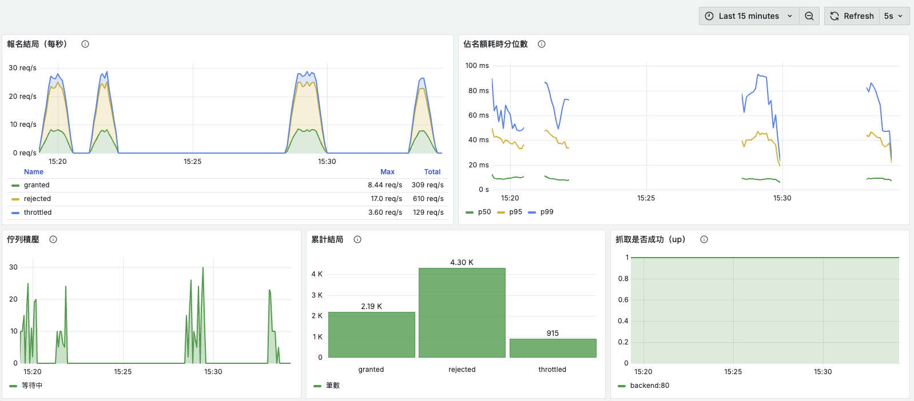

# Sporpulation

前後端分離專案：

- `backend/` — Laravel 13 API (PHP 8.4 + MySQL)
- `frontend/` — Vue 3 SPA (Vite + Vue Router + Pinia)

## 使用 Docker 啟動（推薦）

```bash
docker compose up -d --build
```

- 後端 API：http://localhost:8080/api
- 前端頁面：http://localhost:5173
- 收件匣（Mailpit）：http://localhost:8025 —— 本機寄出的信都會落在這裡，不會真的送出去
- 儀表板（Grafana）：http://localhost:3000 —— 免登入，「Sporpulation — 報名路徑」
- 指標（Prometheus）：http://localhost:9090
- MySQL：localhost:3306

應用程式的指標端點是 `/api/metrics`，但它**從 8080 拿不到（404）**：Prometheus 和 app 節點在
同一個 Docker 網路裡，直接抓 `backend:80`，不必繞出去。

8080 是一台 nginx 負載平衡，後面才是 app 節點；app 節點刻意不對外開埠。要多起幾台：

```bash
docker compose up -d --build --scale backend=3
```

佇列的 worker 是獨立的 `queue-worker` service，不跟 web 擠在同一個容器裡。兩者可以各自
調整數量 —— 報名尖峰與寄信塞車的時間點通常不一樣。

## 本機開發

### 後端

```bash
cd backend
composer install
cp .env.example .env
php artisan key:generate
php artisan migrate
php artisan serve
```

### 前端

```bash
cd frontend
npm install
cp .env.example .env
npm run dev
```

前端透過 `VITE_API_BASE_URL`（預設 `http://localhost:8080/api`）呼叫後端 API；
後端透過 `FRONTEND_URL`（預設 `http://localhost:5173`）設定 CORS 允許來源。

## 活動報名

| Method | Endpoint                            | 說明                                              |
| ------ | ----------------------------------- | ------------------------------------------------- |
| GET    | `/api/activities`                   | 未開始的活動，可用 `sport_id`、`district_id` 篩選 |
| POST   | `/api/activities`                   | 開團（需登入）                                    |
| GET    | `/api/activities/{id}`              | 活動詳情                                          |
| POST   | `/api/activities/{id}/registration` | 報名，佔一個名額                                  |
| DELETE | `/api/activities/{id}/registration` | 取消報名，釋放名額                                |
| GET    | `/api/me/registrations`             | 我的報名                                          |

報名與取消都是冪等的：重送同一個請求不會佔到第二個名額，也不會重複釋放。
名額滿了回 409 `activity_full`，活動已開始回 409 `activity_closed`。

### 冪等碼（選用）

除了上面的天然冪等，任何寫入都可以帶 `Idempotency-Key` 標頭。伺服器會記住第一次的
結果，重送時直接回放並加上 `Idempotent-Replay: true`，不會再執行一次：

```
POST /api/activities/5/registration
Idempotency-Key: a3f1c9d2-7b64-4e01-9f2a-8c5d1e0b4a77
```

不帶標頭就完全不受影響。同一把 key 用在不同請求會被擋下（409 `idempotency_key_reused`），
第一個請求還在跑時的重複請求會收到 409 `request_in_progress`。

紀錄依路由分成兩個後端。**建立活動**存在 `idempotency_keys` 資料表：它沒有天然的唯一鍵
可以兜底，冪等碼是唯一的保證，而資料表不會被例行清除。**報名／取消**存在 Redis（獨立的
db，`cache:clear` 碰不到），靠 TTL 自動過期 —— 它背後還有 `unique(activity_id, user_id)`，
紀錄遺失最多讓重播退化成重新執行，而重新執行會撞上唯一鍵、整筆 rollback。

資料表的過期紀錄由排程每小時 `model:prune` 清理；Redis 那邊不需要，過期是資料儲存本身
在執行的。

### 限流

報名端點對**每個使用者**限制每分鐘 5 次嘗試。超過的請求會拿到 429：

```
HTTP/1.1 429 Too Many Requests
Retry-After: 42

{"message": "報名嘗試太過頻繁，請稍候再試。", "code": "too_many_requests"}
```

`Retry-After` 是算出來的，不是固定值 —— 它等於視窗裡最舊那次嘗試離開視窗還要多久。

額度綁在使用者身上而不是 IP，因此同一個公司網路或 NAT 後面的人不會互相消耗。取消報名
不受限流：正常使用者「報名後發現時間衝突」會馬上取消，不該因此吃掉額度。

### 併發驗證

測試套件跑在 sqlite 上、一次只跑一個請求，驗證得了邏輯但驗證不了併發：它檢查得到
邏輯對不對，但抓不到鎖順序造成的死結，也抓不到兩個請求同時拿走最後一個名額。

下面這個指令會 fork 出真正同時發生的請求，需要 MySQL：

```bash
php artisan activities:check-concurrency --capacity=7 --racers=100
```

100 個行程同時搶 7 個名額的實際輸出：

```
PASS seats granted equals capacity (granted=7 capacity=7)
PASS losers got a clean 409, not an error (rejected=93 errors=0)
PASS counter agrees with confirmed rows (joined_count=7 confirmed_rows=7)
PASS no retry errored (errors=0)
PASS the retries took exactly one seat (joined_count=1 confirmed_rows=1)
PASS the retries wrote exactly one row (rows=1)
PASS no churn worker errored (errors=0)
PASS counter never drifted from reality (joined_count=0 confirmed_rows=0)
PASS counter stayed within capacity (joined_count=0 confirmed_rows=0)
```

三組情境分別是：**多人搶名額**（剛好發出 7 個，其餘 93 個拿到乾淨的 409 而不是錯誤）、
**同一人重試風暴**（20 個並行請求只佔到 1 個名額、只寫 1 筆）、**報名取消交錯**
（12 個行程反覆報名又取消，計數器始終等於實際確認列數）。

它會寫入測試資料，只能指向可拋棄的資料庫。

限流器的「檢查 + 遞減」同樣驗不到 —— 單一行程裡 `ZCARD` 與 `ZADD` 之間不可能被插隊。
這兩個指令 fork 出真正同時抵達的嘗試：

```bash
php artisan limiter:race --naive    # 三次獨立往返的版本
php artisan limiter:race            # 單一 Lua script 的版本
```

| 100 個併發請求，上限 5 | 放行 |
| --- | --- |
| 三次獨立往返 | 25 / 99 / 53 / 62 / 73（每次都不同）|
| 單一 Lua script | 5 / 5 / 5 / 5 / 5 |

非原子版**在單元測試裡是全綠的** —— 它的錯誤只在併發下出現，而且錯誤的程度隨機。
最糟的一次讓 99 個請求全部通過了「每分鐘 5 次」的限制。

冪等的佔位是同一件事，只是兩個後端用不同的機制達成：

```bash
php artisan idempotency:race --store=redis      # Lua script
php artisan idempotency:race --store=database   # unique(user_id, key_hash)
```

| | 50 併發 | 200 併發 |
| --- | --- | --- |
| Redis | 搶到 1，錯誤 0 | 搶到 1，錯誤 0 |
| MySQL | 搶到 1，錯誤 0 | 搶到 1，**錯誤 26~49** |

兩個後端的正確性都守住了（永遠只有一個贏家），但 MySQL 在 200 併發下撞上
`max_connections = 151`，有幾十個請求根本沒被服務。**資料庫昂貴的不只是延遲，是連線槽
這個很小的有限資源** —— 而那正是限流在保護的東西。

最後量限流實際替資料庫擋下了多少工作。這個指令發出真正的 HTTP 請求（走完整的
middleware 堆疊），並直接向 MySQL 詢問執行過的語句數：

```bash
php artisan throttle:check --off    # 對照組
php artisan throttle:check
```

| 100 個併發請求 | 通過 | MySQL 語句數 |
| --- | --- | --- |
| 限流關閉 | 100 | 1088 |
| 限流開啟 | 5 | 405 |

降到 37%，但**降不到零**：`auth:sanctum` 與 route model binding 都排在限流之前，因此
每個被擋下的請求仍付出約 3 次 SELECT（token、user、activity）。要讓它更便宜，就得把限流
移到認證之前 —— 但那樣只能用 IP 當 key，同一個 NAT 後面的人會共用額度。**用公平性換成本。**

## 設計取捨

### 名額為什麼用 counter，不用 `COUNT(*)`

`activities.joined_count` 是反正規化的計數，`activity_registrations` 才是真相來源。
直接 `COUNT(*)` 也能算出目前人數，但那樣就沒有東西可以「原子地」檢查並佔用名額 ——
先 COUNT 再 INSERT 中間永遠有空隙，兩個請求會同時看到還有位子。

有了 counter，佔用名額就是**一句 SQL**，判斷條件放在 `WHERE` 裡：

```php
$claimed = static::whereKey($this->id)
    ->whereColumn('joined_count', '<', 'capacity')
    ->increment('joined_count');

if ($claimed === 0) {
    throw new ActivityFullException;   // 影響列數為 0 就是額滿
}
```

代價是計數可能與實際列數不一致，所以 `check-concurrency` 每一輪都會驗
`joined_count === confirmed_rows`。

### 為什麼是條件式 UPDATE，不是 `SELECT ... FOR UPDATE`

悲觀鎖也能正確，但要在交易中持鎖跨越一次來回；條件式 UPDATE 把讀與寫壓成單一敘述，
鎖只存在於該敘述執行期間。

不過**鎖順序**仍然重要。所有會動到名額的路徑都先取得 activities 那一列的寫入鎖，
再碰 `activity_registrations`。這不是潔癖：插入報名紀錄時，外鍵檢查會對母活動列取得
**共享鎖**，如果交易接著才想把它升級成排他鎖，就會跟其他所有報名者互相死結。開發過程
中先寫報名紀錄再扣名額的版本，40 個行程搶 5 個名額時只發出 2 個、38 個請求死於
SQLSTATE 40001，就是這個原因。改成先取排他鎖之後，報名者會在活動列上排隊而不是互鎖。

順帶一提，`joined_count` 與「名額（seat）」是刻意區分的兩個詞：前者是欄位與 API 欄位
名稱，後者只出現在方法名稱與說明文字（`claimSeat`、`releaseSeat`、`remainingSeats`）。
這條規則寫在 `Activity` 的 class docblock。

### 報名的冪等為什麼靠唯一鍵，而不是先查再寫

「先查有沒有報過，再決定要不要寫」在併發下同樣有空隙。改成讓
`unique(activity_id, user_id)` 來裁決：**先佔名額，再寫報名紀錄**，兩者包在同一個
transaction 裡。重送的請求會撞上唯一鍵，整筆 rollback，名額跟著還回去。

取消與重新報名則用條件式 UPDATE 當守衛（`WHERE status = Confirmed` /
`= Cancelled`），確保只有真正翻動狀態的那一個請求能動計數器 —— 一個名額只會被釋放
或取回一次。

因此報名有兩層保護：冪等碼擋在資料庫之前，唯一鍵是最終保證。開團沒有天然唯一鍵，
只有冪等碼這一層。

### 冪等紀錄為什麼從資料庫搬到 Redis（以及為什麼沒有全搬）

這個專案原本的判斷是：

> 刻意存在資料庫而非快取：快取會被例行清除（`cache:clear`、記憶體不足時被驅逐），
> 而這些紀錄一旦遺失，保護就會無聲無息地消失。

那句話仍然成立 —— 只是它現在只適用於**沒有第二層防線**的寫入。

搬到 Redis 換到的是兩件事：每個請求少一次 SQL 往返（`throttle:check` 量到的
[1088 → 405](#併發驗證) 裡有一部分是它），以及「過期」不再需要應用程式碼參與。資料庫
沒有 TTL，所以 `DatabaseIdempotencyStore::claim()` 必須自己判斷紀錄過期了沒、自己刪掉、
自己重試一次，還要靠 `model:prune` 每小時掃一遍；Redis 版那整段程式碼**不存在**，因為
過期是資料儲存本身在執行的。

#### 犧牲了什麼

責任沒有消失，只是換人扛 —— 而新的那個人比較容易失手：

| | 這個專案目前的狀態 |
| --- | --- |
| **崩潰遺失** | `redis:7-alpine` 只做 RDB 快照（`save 3600 1 / 300 100 / 60 10000`），`appendonly no`。最壞情況丟掉崩潰前 60 秒的紀錄。要更強就開 AOF，代價是每秒 fsync。 |
| **記憶體驅逐** | 本機 `maxmemory 0` / `maxmemory-policy noeviction`，不會驅逐。**但託管的 Redis 常預設 `allkeys-lru`** —— 那樣紀錄會在還沒到期時被安靜踢掉，正是上面那句擔憂換了個形式回來。部署前務必確認。 |
| **`cache:clear`** | 躲掉了：`Cache::flush()` 對 Redis 的實作是 `FLUSHDB`，而冪等紀錄放在獨立的 db 2，快取在 db 1。躲不掉的是 `FLUSHALL`。 |
| **Redis 不可達** | 冪等是 fail closed（回 500，寧可拒絕服務也不重複執行）；限流是 fail open（放行，因為它只是第一層過濾）。**同一個故障，兩個 middleware 刻意相反。** |

值得強調第二列：分開 db 解決的是「不要跟會被例行清空的東西共用命名空間」，**不是**
「Redis 很可靠」。驅逐與持久性那兩項還在。

#### 因此哪些能搬、哪些不能

| 寫入 | 後端 | 為什麼 |
| --- | --- | --- |
| `POST /activities` | 資料庫 | 沒有天然唯一鍵，冪等碼是**唯一**的保證。紀錄遺失 = 重試留下第二場活動，而且沒有任何東西會發現。 |
| `POST /activities/{id}/registration` | Redis | `unique(activity_id, user_id)` 在後面兜底。紀錄遺失時重播退化成重新執行，而重新執行會撞唯一鍵、整筆 rollback、名額還回去 —— 壞掉的是回應內容，不是資料正確性。 |
| `DELETE /activities/{id}/registration` | Redis | 同上，取消由 `WHERE status = Confirmed` 的條件式 UPDATE 守著。 |

判斷準則寫成一句話：**這個寫入有沒有第二層防線？有 → Redis 可以。沒有 → 必須資料庫。**

選擇寫在路由旁邊（`routes/api.php` 的 `idempotent:database` / `idempotent:redis`），而不是
藏在設定檔裡 —— 下一個加路由的人會先看到它。打錯名稱會丟例外而不是安靜地退回預設值，
`RouteStoreNamesTest` 讓這件事在部署前就被發現。

#### 結論

**Redis 是第一層過濾：快、可失效。資料庫的唯一鍵是最終保證：慢、不可失效。**

兩層的職責不同，因此判準也不同 —— 第一層可以為了可用性而放水（限流 fail open），
最終保證不行。這個系統裡同樣的結構出現了三次：限流之於報名、冪等碼之於唯一鍵、
Redis 之於資料庫。

### 哪些事必須同步，哪些可以搬到佇列

判準是一句話：**這件事失敗了，使用者的報名還算不算數？**

| | 算不算數 | 因此 |
| --- | --- | --- |
| 佔名額（`claimSeat`） | 不算 —— 沒佔到就是沒報到 | 同步 |
| 寫 `activity_registrations` | 不算 | 同步 |
| 寫冪等紀錄 | 算，但重試會重複執行 | 同步 |
| 寄報名確認信 | **算** —— 信沒寄到，位子還是他的 | **佇列** |

線畫在「影響資料正確性」與「只影響體驗」之間。代價是「報名成功」與「使用者知道自己
報名成功」之間出現了時間差 —— 正常是毫秒級，worker 掛掉時可能是幾分鐘，而 API 早就
回 201 了。這是刻意接受的：用「使用者可能晚幾秒收到信」換「請求路徑不被郵件伺服器的
延遲綁架」。反過來做的話，SMTP 慢三秒，報名 API 就慢三秒。

worker 跑在獨立的容器（`docker-compose.yml` 的 `queue-worker`），不跟 web 擠在一起 ——
報名尖峰與寄信塞車的時間點通常不一樣，綁在一起就只能一起加。

#### `after_commit` 是一把上了膛的槍

Laravel 佇列預設 `after_commit => false`，意思是 `dispatch()` 當下就把 Job 推進 Redis，
不管外層交易有沒有提交。把 dispatch 寫在交易裡就會踩到這個時序：

```
t0  BEGIN
t1  INSERT activity_registrations      還沒 commit
t2  dispatch → Job 立刻進 Redis
t3  worker 撈到，find(id) → null       未提交的資料看不到
t4  Job 安靜結束（它「成功」了）
t5  COMMIT                             報名成立
```

實際重現的結果：

| | worker 處理時間 | 寄出的信 | Job 狀態 | 資料庫 |
| --- | --- | --- | --- | --- |
| `after_commit => false` | COMMIT 前 3 秒 | **0** | DONE | 報名成立 |
| `after_commit => true` | COMMIT 後 | 1 | DONE | 報名成立 |

**Job 回報成功、信永遠不寄、報名卻是成立的，而且零錯誤、死信佇列裡也沒有東西。**
唯一的發現方式是使用者跑來說沒收到信。

值得注意的是 Job 裡那個防禦性的 `if ($registration === null) return;` 在這裡幫了倒忙：
它把一個競態變成了靜默的資料遺失。沒有那行的話，Job 會失敗、重試、進死信 —— 至少
看得到。（那行對「使用者真的取消了」仍然是對的，問題是它同時吞掉了另一個原因。）

`after_commit => true` 只解決一半。它是在同一個 PHP 行程裡監聽交易提交事件，然後才推進
Redis，所以還剩一個視窗：

```
COMMIT 成功  →  [行程在這裡被 kill]  →  Job 從未入列
```

資料寫了、Job 沒了。這是經典的 **dual write** —— 在 MySQL 和 Redis 各寫一次，而兩者之間
沒有共同的交易。真正的解法是 **transactional outbox**：把 Job 當成一列資料寫進同一個
交易的表，另一個行程再從那張表投遞，讓「資料寫了但 Job 沒了」變成不可能。這個專案沒有
做 —— 現階段的正確做法是知道這個視窗存在、知道它有多窄，然後接受它，而不是假裝
`after_commit => true` 解決了一切。

#### at-least-once 逼出的問題，你已經解過一次

佇列承諾的是 at-least-once：worker 處理到一半掛掉、或處理時間超過 `retry_after`，同一個
Job 會被再投一次。所以**消費者必須冪等**，否則使用者會收到兩封信。

這跟 API 層的冪等是同一個問題，只是換了一層：

| | 重複的來源 | key |
| --- | --- | --- |
| API 層 | 用戶端重試 | 用戶端送的 `Idempotency-Key` |
| 訊息層 | 佇列重新投遞 | Job 的 `uuid`（重投之間不變） |

兩層共用同一個 `RedisIdempotencyStore`，只是命名空間不同：

```
laravel-database-idem:1:9f2a…                          API 層，scope = 使用者 id
laravel-database-idem:job:registration-confirmation:…  訊息層，scope = Job 類型
```

而它**只能**用 Redis 後端 —— `DatabaseIdempotencyStore` 的 `user_id` 有外鍵約束，scope
不能是任意字串。上一節那張分級表在這裡第一次被實際使用。

**為什麼 key 是 job uuid 而不是 `registration_id`**：`join()` 在「取消後重新報名」時沿用
同一列，id 不會變，用它當 key 會把第二次報名的確認信誤判成重複而丟掉。uuid 精確對應
at-least-once 造成的那一種重複，不多不少。應用程式不小心 dispatch 兩次是另一個問題，
由另一層（`Idempotency-Key`）負責。

**為什麼是「先寄信、後標記」而不是「先佔位、後寄信」**：

| | 當機落在中間時 |
| --- | --- |
| 先佔位（原子，絕不重複） | 佔位還在、信沒寄出 → 重試被自己的去重擋掉，**信永遠遺失** |
| 後標記（非原子，可能重複） | 沒標記到 → **重試會重寄一封** |

對確認信來說重複遠比遺失好：收到兩封只是皺個眉，收不到會讓人以為報名失敗。而這正是
at-least-once 的立場 —— 佇列選擇了「寧可重複也不遺失」，消費者就該跟它站在同一邊。
同理，Redis 不可達時去重會 fail open（照寄），因為去重是最佳化而不是正確性保證。

**這個方向不是系統層級的決定，是每個 Job 各自回答一次的問題。** 換成扣款就完全不同：
兩個方向都很糟（先佔位可能錢扣了卻沒紀錄，後標記可能重複扣款），正解是把冪等責任推給
擁有副作用的一方 —— 金流商接受 idempotency key，由他們保證 at-most-once，之後你的 Job
就能放心重試。那正是你的 API 對用戶端做的事，角色對調而已。

#### 失敗不會無聲消失

重試的次數與間隔寫在 Job 上，而不是只靠 worker 的 `--tries`：worker 旗標是所有 Job 的
共同預設值，但政策屬於這件工作本身 —— 確認信三次就夠，對外的 webhook 可能值得更多次、
更長的間隔。

`backoff` 預設是 **0**，意思是三次重試會在幾十毫秒內全部用完。對「郵件伺服器斷線幾秒」
這種最常見的故障完全沒有幫助 —— 它只是用最快的速度把 Job 推進死信。改成 `[10, 60]`。

把 worker 的 SMTP 指向一個會拒絕連線的位址，實測完整的失敗生命週期：

```
18:13:22  嘗試 1  FAIL
18:13:34  嘗試 2  FAIL   ← +12 秒（backoff[0] = 10）
18:14:34  嘗試 3  FAIL   ← +60 秒（backoff[1] = 60）
          ↓
failed_jobs: fea53678-…  redis@default  App\Jobs\SendRegistrationConfirmation

local.ERROR: 報名確認信最終失敗，已進入死信
  {"registration_id":85,"job_uuid":"fea53678-…","exception":"Connection could not be established…"}
          ↓
queue:retry all  →  DONE  →  信真的寄出了
```

⭐ **`failed()` 才是這一步的重點，不是 `failed_jobs` 這張表。** Laravel 預設只是安靜地
寫進去，而那張表沒有人會主動去看 —— 「失敗不會無聲消失」這個保證是由那個 handler 提供的，
不是由表提供的。它記下 `job_uuid`，也就是去重用的 key，出事時可以直接拿它去 Redis 查
這封信到底寄出去沒有。

三次失敗都在 `Mail::raw()` 拋例外時中斷，所以標記（寫在寄信之後）從未執行 —— **失敗不會
毒化去重紀錄**，重放時信真的寄得出去。這是上一節選「後標記」順帶換到的性質。

#### 這條邊界買到了什麼

`registration:latency` 送出 100 個真實請求（走完整 middleware 堆疊），`--sync` 把佇列連線
切成 `sync` 讓確認信在請求路徑上同步寄出 —— 也就是「如果沒有佇列會怎樣」。每一輪 POST
之後緊接一個不計時的 DELETE，讓每次 POST 都真的在佔名額，而不是撞上 `join()` 的短路。

| 寄信方式 | p50 | p95 | p99 | max |
| --- | --- | --- | --- | --- |
| 佇列（現況） | **2.3 ms** | 3.5 ms | 4.0 ms | 14.6 ms |
| 同步（無佇列） | **49.4 ms** | 51.8 ms | 54.5 ms | 63.5 ms |

p50 相差約 21 倍，兩次重跑的數字幾乎一致。

三個必須一起講的但書：

**47 毫秒是下限，不是上限。** 本機的 Mailpit 與 backend 在同一個 Docker 網路上，往返幾乎
沒有網路成本。換成真實的郵件商是 100–500 毫秒，遇到對方限流或重試更久 —— 正式環境的差距
只會更大。

**2.3 毫秒裡已經包含 dispatch 的成本**（一次 Redis 往返）。佇列不是讓工作消失，是把
47 毫秒的工作換成 1 毫秒的工作。

**真正的收穫在 p99，不在 p50。** Mailpit 很穩，所以同步版的 p99 只比 p50 高 5 毫秒。真實
郵件商的 p99 會遠高於 p50（連線池耗盡、對方限流、TLS 握手變慢），而那條尾巴會**原封不動
地變成你 API 的尾巴**。佇列切斷了這條相依性：郵件商的 p99 再糟，你的報名 API 也只是佇列
變長而已。

**非同步邊界買到的不只是「比較快」，是「你的延遲不再取決於別人的延遲」。**

### 叢集裡到底有幾個地方需要分散式鎖

先盤點，再決定。整個系統有十個並行熱點：

**由 MySQL 仲裁 —— 不需要任何外部鎖**

| 位置 | 憑什麼跨節點正確 |
| --- | --- |
| `Activity::claimSeat()` | `WHERE joined_count < capacity` 的條件式 UPDATE，檢查與遞增壓成單一敘述 |
| 報名的 `unique(activity_id, user_id)` | 唯一索引，並行 INSERT 只有一個能成功 |
| 取消／重新報名的 `WHERE status = …` | 同上，只有真正翻動狀態的那個能動計數器 |
| `DatabaseIdempotencyStore::claim()` | `unique(user_id, key_hash)` |

**由 Redis 仲裁 —— 也不需要**

| 位置 | 憑什麼 |
| --- | --- |
| `SlidingWindowLimiter::attempt()` | Lua script，Redis 單執行緒執行 |
| `RedisIdempotencyStore::claim()` | Lua script |
| Job 去重 | 走上面那個 |
| 多個 worker 搶同一個佇列 | Redis list 的原子 pop，一個 Job 只會給一個 worker |

**真正需要協調的只有兩個**

| 位置 | 為什麼 |
| --- | --- |
| `model:prune` 排程 | `schedule:work` 無條件跑在每個 backend 容器裡 → N 個節點清 N 次 |
| `entrypoint.sh` 的 `migrate` | 每個容器都跑 → N 個節點同時 migrate |

⭐ 而前八項**在 M1 就已經證明過了**。`activities:check-concurrency` fork 出的 100 個獨立
行程各開自己的 MySQL 連線 —— 從 MySQL 的角度看，這跟 100 台 app 節點是無法區分的。多節點
唯一多出來的是「節點之間的網路」，但 app 節點彼此完全不通訊，它們只跟 MySQL 和 Redis 講話。
`idempotency:race` 與 `limiter:race` 同理涵蓋了 Redis 那組。

**當初是為了驗證原子性寫的三個指令，回頭看其實就是跨節點正確性的證明。**

#### 兩節點實測

```bash
docker compose up -d --build --scale backend=2
```

把排程暫時改成 `everyMinute()` 之後觀察兩個節點：

```
無鎖   19:14:00  backend-1  model:prune … 67.25ms DONE
       19:14:00  backend-2  model:prune … 68.06ms DONE       ← 同一秒跑了兩次

有鎖   19:18:00  backend-1  model:prune … 64.39ms DONE
                 backend-2  Skipping … because the command already ran on another server.
```

#### 鎖不是正確性的來源

`migrate --isolated` 的語意是**互斥**，不是「整個叢集只跑一次」—— 前一台釋放鎖之後，
下一台仍會跑一次。實測兩個節點都印出 `Nothing to migrate`。

這樣就夠了，因為真正的保證不在鎖上：

| | 鎖提供的 | 正確性其實來自 |
| --- | --- | --- |
| `migrate --isolated` | 不會兩台同時 migrate | `migrations` 資料表，每個檔案一輩子只套用一次 |
| `model:prune` + `onOneServer()` | 這一輪只跑一次 | 清理本身冪等，刪的是已過期的列 |

**兩把鎖都是最佳化，不是正確性保證。** 它們失效時系統仍然是對的，只是多做了一次白工。

#### 為什麼不需要 Redlock

`onOneServer()` 底層是 `Cache::lock()`，而 cache 是單一 Redis。它在 failover 時會失效：

```
節點 A 取得鎖 → 寫進 master
master 掛掉、replica 升主 → 那筆鎖還沒複製過去（Redis 複製是非同步的）
節點 B 向新 master 取鎖 → 成功
兩個節點同時持有「同一把鎖」
```

Redlock 是官方對此的答案（向 N 個獨立節點取鎖、過半數才算持有），但 Martin Kleppmann 的
著名反駁指出它依賴時鐘的正確性：只要有 GC 暫停、行程被 SIGSTOP、VM 被暫停或 NTP 調整時鐘，
持鎖者可能在**自己毫不知情**的情況下超過鎖的有效期，而另一個節點已經合法取得了鎖。antirez
有回應，爭論至今沒有結論。

重點不是誰對，而是這個更根本的限制：

> **分散式鎖無法同時保證互斥與活性。** 沒有 TTL，持鎖者當機就永久卡死；有了 TTL，就可能
> 在持鎖者還活著時過期。你只能選一邊。

所以真正的結論不是「該用哪種鎖」，而是：

> 這個叢集裡**沒有任何一個地方的正確性依賴分散式鎖**。鎖只出現在兩個「跑兩次會浪費、但
> 不會出錯」的位置，因此單一 Redis 的鎖就夠用。佔名額完全沒有用到鎖 —— MySQL 就是仲裁者。

**需要一把完美分散式鎖的系統，通常是設計上還可以再簡化的系統。**

### 三個節點掛負載平衡，正確性有沒有變

`docker compose up -d --build --scale backend=3` 起三個 app 節點，前面掛一台 nginx
（`least_conn`）。backend 刻意不對外開埠 —— 否則 `--scale` 出來的節點會有一台拿得到直連
流量、其餘拿不到，壓測結果就沒有意義。

`activities:check-concurrency` 原本是直接呼叫 `$activity->join()`，完全不經過 HTTP。加上
`--url` 之後，fork 出的請求會打進 LB，走完整的 middleware 堆疊。

#### 先證明流量真的分散了

```bash
php artisan activities:check-concurrency --capacity=10 --racers=200 --url=http://localhost:8080
```

| 節點 | 實際處理的 POST |
| --- | --- |
| backend-1 | 185 |
| backend-2 | 194 |
| backend-3 | 181 |

**這一步不能跳過。** 如果三個節點的計數是 `560 / 0 / 0`，那下面的「零超賣」就什麼都沒
證明 —— 那只是單機測試換了個包裝。LB 設定裡的 `add_header X-Served-By $upstream_addr`
就是為此存在的。

#### 零超賣

```
CONFIG  nodes=3  lb=nginx(least_conn)  racers=200  capacity=10

PASS  seats granted equals capacity        (granted=10 capacity=10)
PASS  losers got a clean 409, not an error (rejected=190 errors=0)
PASS  counter agrees with confirmed rows   (joined_count=10 confirmed_rows=10)
PASS  the retries took exactly one seat    (joined_count=1 confirmed_rows=1)
PASS  counter never drifted from reality   (joined_count=0 confirmed_rows=0)
PASS  counter stayed within capacity
```

加了兩台節點與一台負載平衡，正確性**一個字都沒變** —— 因為它從來不是由「只有一台機器」
這個假設支撐的，而是由 MySQL 的條件式 UPDATE 與唯一索引支撐的。

兩種模式留著都有用，它們隔離的變數不同：

| | 證明的事 |
| --- | --- |
| 行程內（無 `--url`） | **資料庫的保證**。沒有 middleware、沒有限流干擾 |
| HTTP（`--url`） | **整條路徑的保證**。經過 LB、三個節點、完整 middleware |

在 HTTP 模式下，429 與 409 同樣算「乾淨的拒絕」而不是錯誤 —— 兩者都代表請求被明確擋下、
什麼都沒壞。限流在這條路徑上是系統的一部分，不是干擾。

#### 加一台負載平衡，順手削弱了一個保護

`bootstrap/app.php` 原本沒有設定 `trustProxies`，所以 Laravel 不信任 `X-Forwarded-For`：

```
模擬 lb 轉來的請求（真實用戶端 203.0.113.9，lb 自己 172.18.0.9）
middleware 執行前: 172.18.0.9
middleware 執行後: 203.0.113.9   ← 設定 trustProxies 之後
```

沒有這行設定時，**全世界的請求都變成同一個來源 IP**。報名的限流綁在 user id 上所以沒事，
但 `/auth/register` 與 `/auth/login` 用的是 Laravel 內建的 `throttle:10,1`，對未登入請求
是**按 IP** 計數的：

- 「每個 IP 每分鐘 10 次」變成「**全世界每分鐘 10 次**」
- 正常使用者互相踩額度，而攻擊者可以用 10 次/分鐘癱瘓所有人的登入

一台負載平衡器，把一個保護變成了一個攻擊面。而 `trustProxies(at: '*')` 的安全性完全建立
在「app 節點無法被直連」這個前提上 —— 哪天有人為了除錯把 backend 的埠開出去，攻擊者就能
偽造 `X-Forwarded-For` 繞過所有按 IP 的限流。

#### 吞吐與延遲，以及一個被推翻的假設 ⭐

```
THROUGHPUT  105 req/s   （200 個請求 / 1.91 秒）
LATENCY     p50=1255ms  p95=1840ms  p99=1873ms  max=1883ms
```

p50 超過一秒，明顯太慢。查到 `pm.max_children = 5`（`php:fpm-alpine` 的預設值），於是有了
一個看起來很合理的假設：

```
假設   3 節點 × 5 = 15 個 worker，要消化 200 個併發請求
算術   200 / 15 ≈ 每個 worker 排 13 輪，每輪約 90ms ≈ 1.2 秒
       ↑ 與量到的 p50=1255ms 幾乎完全吻合
行動   改成 pm = static / max_children = 20（15 → 60 個 worker）
結果   90 req/s、112 req/s ── 與改之前的 105 同屬雜訊範圍，沒有變快
追查   壓測期間三個節點的 CPU 全程低於 10%，MySQL 低於 5%
結論   瓶頸從來不在 php-fpm
```

真正的瓶頸是**壓測用戶端**：200 個 forked PHP 行程，每個都要複製整個 Laravel 的記憶體、
建立自己的 Guzzle client、做 DNS 與 TCP 握手。這些成本全部被算進了「延遲」，但它們是
用戶端的成本。

**所以這組吞吐與延遲不能當作系統的上限 —— 它量到的是壓測工具的上限。** 要量出系統真正的
天花板，需要 k6 或 wrk 這類用連線池、非阻塞 I/O 的工具，而且要跑在另一台機器上。

而那個吻合到 1255ms 的算術，是這一段真正的教訓：

> **一個吻合的算術不構成證據。** 兩個獨立的錯誤（錯的瓶頸假設、錯的請求耗時估計）可以
> 相乘出一個看起來完美的答案。唯一能區分的方法是：改動它，然後看數字有沒有動。

`pm.max_children = 20` 最後保留了下來 —— 因為 5 對任何真實節點都太低，依「max_children ×
單一行程大小 ≤ 節點記憶體」推算是合理的工程判斷。但 Dockerfile 的註解明講了它**沒有被本機
的數據支持**，真正該回頭調它的時機是上線後觀察到 fpm 的請求佇列積壓。


### 三個節點的 log 混在一起，怎麼查一筆報名

加到三個節點之後，log 出現一個 M1 到 M3 都不存在的問題：**你有一份交錯的文字檔，而且看不出
哪一行是誰寫的。** 使用者說「我報名失敗了」，你只剩時間戳可以猜。

兩步解決。第一步把每一行變成一個 JSON 物件並寫到 stderr，交給 Docker 收集 —— 容器的慣例是
「行程只管吐，收集是外面的事」。Laravel 其實早就預留好了，`LOG_CHANNEL=stderr` 加
`LOG_STDERR_FORMATTER=Monolog\Formatter\JsonFormatter` 就結束，**不用寫任何程式碼**。

真正的工作在容器層，三個 php-fpm 設定少一個都不行：

| 設定 | 少了它會發生什麼 |
|---|---|
| `catch_workers_output = yes` | fpm 不接管子行程的 stderr，Laravel 寫出去的東西直接消失 |
| `decorate_workers_output = no` | 每一行被包成 `WARNING: [pool www] child 8 said into stderr: "..."`，不再是合法 JSON |
| `log_limit = 8192` | 超過 1024 bytes 就截斷，而截斷過的 JSON 是壞掉的 JSON |

最後那一個特別陰險：它只會弄壞「內容比較長」的那幾筆，而那剛好就是出事時你最想看的幾筆。

#### 一個請求，四個地方，同一個 id

第二步是 request id。它在**負載平衡**產生，不是在 Laravel：沒有進到 app 的請求（502、504、被
nginx 自己擋掉的）也需要 id，而那些正好是最難查的。

```jsonc
// lb（nginx 存取紀錄）
{"request_id":"a2ecb43…","path":"/api/activities/1/registration","status":201,
 "upstream":"172.18.0.7:80","request_time":0.045,"upstream_time":0.045}

// queue-worker（另一個容器、另一個行程）
{"message":"報名確認信已送出",
 "context":{"request_id":"a2ecb43…","job_uuid":"44259c9a…","node":"eaf83b68…","registration_id":81}}
```

中間那段 —— **從 web 到 worker** —— 是整條鏈最容易斷的地方：兩個容器、兩個行程，中間只剩
Redis 裡的一包 payload。斷掉的症狀是「使用者說沒收到信」，而你手上有請求的 log、有寄信的
log，就是無法確定它們是不是同一件事。

接法是掛在 `Queue::createPayloadUsing` 與 `Queue::before` 兩個全域鉤子上，而不是讓每個 Job
自己記得帶。「記得帶」這種事只要有一個 Job 忘記，追蹤鏈就從那裡開始斷，而且是安靜地斷。

#### 為什麼收下外部帶進來的 id

`AssignRequestId` 會**優先採用呼叫端帶進來的** `X-Request-Id`。理由是真實系統裡你不是鏈條的
起點；每一跳都自己產一個，就得到三段互不相連的追蹤紀錄。

代價是這個值變成不可信輸入，所以要限制形狀。而那條正規表達式差點就寫錯了：

```php
preg_match('/^[A-Za-z0-9._-]{1,64}$/',  "abc\n")   // → 1   通過了
preg_match('/^[A-Za-z0-9._-]{1,64}$/D', "abc\n")   // → 0   加了 D 才擋下
```

PCRE 的 `$` 預設也匹配「結尾換行之前」。少了 `D`，`"abc\n"` 會被當成合法 id 原樣寫進 log，
收集端看到的就是兩筆而不是一筆 —— 這就是 log injection。

> 這個洞是在補「**會失敗的那種測試**」時才浮出來的。前面九個測正確輸入的綠燈一個都沒抓到。

**可追蹤性要求你信任上游，安全性要求你不信任。折衷是「收下，但限制形狀」。**

---

### 指標要存在哪裡，在這個拓撲下其實沒得選

直覺的寫法在這個架構下等於沒寫：

```php
class Metrics {
    private static int $registrations = 0;   // php-fpm 每個請求都是獨立行程
}                                            // 加到 1 就隨請求死掉
```

三個選項，但只有一個活得下來：

| 存哪裡 | 問題 |
|---|---|
| APCu（節點內共享記憶體） | 快，但 **queue-worker 是另一個容器、沒有 HTTP 埠可以被抓取** —— 它的計數完全沒有出口 |
| Push Gateway / StatsD | 改成推送模型，多一個要維運的元件 |
| **Redis** | worker 寫得進去，任何節點都讀得到 |

**這個決定的代價要先講出來：** Redis 是共享的，所以三個節點的 `/metrics` 回傳一模一樣的數字
（整個叢集的總和）。後果是 Prometheus **不能同時抓三個節點** —— 那會把每個數字乘以三。只能抓
一個目標，也就失去了每節點的分項。

換成 APCu 剛好相反：每節點分項有了，但「佇列積壓」這種描述**共享狀態**的指標會被三個節點各報
一次、加總三倍。

> **沒有一種存法對所有指標都對。** 這是 Prometheus 建模的一條真規則：共享狀態不該由多個複本
> 各自回報。

#### 積壓為什麼是 gauge，而且是現場去數

計數器只增不減。「等待中的工作數」是**此刻的狀態**，不是「發生過幾次」—— 用計數器表達它，
圖表會變成一條永遠往上的線。

而且它刻意**不是**入列 `+1`、處理完 `-1`，而是抓取當下直接問 Redis `LLEN`。後者只要漏掉一次
遞減（worker 被 kill、容器被回收）就永遠錯下去，而且錯得無法修正。

這跟前面「名額為什麼用 counter 而不用 `COUNT(*)`」剛好是**相反方向**的判斷。差別在於有沒有
守衛：名額的正確性由條件式 `UPDATE ... WHERE joined_count < capacity` 保證，漂移不可能發生；
佇列長度沒有那種守衛，所以選擇每次重新數。

---

### 讓 p99 是量出來的，不是嘴出來的 ⭐



#### 埋在哪一層，是資訊決定的，不是方便決定的

兩個指標刻意埋在不同的地方：

| 指標 | 埋在哪 | 為什麼不能埋在別處 |
|---|---|---|
| `registration_attempts_total` | 路由鏈**最外層**的 middleware | controller 看不到全部結局：429 被限流擋在外面、冪等重播在 middleware 就短路了、409 是例外 |
| `seat_claim_duration_seconds` | **controller** | 只有那裡知道「搶名額」那一段從哪開始到哪結束；整個請求的耗時 nginx 的存取紀錄已經有了 |

順序有意義：計數的 middleware 必須包在限流**外面**，否則被擋下的請求根本不會經過它，
`throttled` 永遠是 0。這條主張用變異測試證明過 —— 把它移到限流後面，對應的測試就變紅。

耗時用 `finally` 記錄，而不是只在成功之後：**搶輸的請求正是延遲最可能異常的一群**，排除它們
會讓圖表在最需要它的時候變得好看。

重播和真的搶到狀態碼一樣（都是 201），靠 `Idempotent-Replay` 標頭分開計 —— 混在一起會讓
「成功報名數」被重試灌水。

#### 量到的數字

15 輪跨節點壓測（3 個節點、每輪 40 個併發報名、容量 10），6490 筆佔名額觀測：

```
佔名額耗時（直方圖，非平均值）    p50 = 11 ms    p95 = 48 ms    p99 = 93 ms
壓測用戶端量到的端到端延遲        p50 ≈ 200 ms
                                  ────────────────────────────────────
                                  佔名額只占整個請求的 5%
```

M4 當時只能靠 CPU 取樣**間接推論**「瓶頸不在後端」。現在是直方圖直接量出來的 —— 這正是這個
里程碑存在的理由。

其他：峰值 granted 8.4/s、rejected 17.0/s、throttled 3.6/s；佇列積壓峰值 30；`up` 全程為 1。

#### 指標推翻了我自己寫下的假設 ⭐

`docker/lb/nginx.conf` 裡原本有這句：

> `least_conn` 而不是預設的 round-robin：報名請求的耗時不平均（**撞上唯一鍵而 rollback 的比
> 成功的快得多**）

括號裡那半句**方向就是錯的**：

| | granted | rejected |
|---|---|---|
| 平均 | 11.2 ms | **13.0 ms** |
| p95 | 30.8 ms | **45.2 ms** |

rollback 不是免費的。`least_conn` 的**選擇仍然對**（耗時不平均，方向不影響結論），但當初寫下
的理由是錯的 —— 那句話是憑直覺寫的，聽起來很有道理，沒有任何數字支持。

這裡還有第二層教訓。第一次拿到的樣本只有 125 筆，算出來是 18.0 ms 對 31.1 ms，看起來差了
將近一倍；樣本累積到 6490 筆之後變成 11.2 對 13.0。**方向站得住，幅度是小樣本誇大的。**

> 承接 M4 那句「一個吻合的算術不構成證據」：這一節的版本是 **一句聽起來合理的話也不構成
> 證據，而一個方向正確的小樣本仍然會給你一個錯的幅度。**

#### 「通過」有兩種，這一節撞到三次

M5 的除錯過程本身就是它要教的東西。連續壓測時有幾輪安靜地失敗，三次都差點被當成沒事：

```
1. grep -E 'THROUGHPUT|LATENCY'
   只留下預期看到的行 → 失敗的那幾輪變成一片空白，看起來像「沒事發生」

2. if grep -q 'THROUGHPUT'; then 成功
   輸出裡明明有那個字，卻判成失敗。Laravel 的錯誤渲染器夾帶控制字元，
   grep 一旦把輸入當二進位就不再比對
   → 判定條件必須用退出碼，不能用 grep

3. 在指令裡加 racers() helper 產生唯一 email
   堵住了三個呼叫點，堵不住 Activity::factory() 內部的 host_id => User::factory()
   → 修在症狀上，不是修在根源
```

根源是一句錯誤的假設：**`fake()->unique()` 的記憶只活在單一 PHP 行程裡。** 測試用
`RefreshDatabase` 每次清空資料庫所以成立；壓測指令往一個持續累積的資料庫寫、而且每輪都是新
行程，就不成立了 —— Faker 重新開始記，資料庫沒有忘記。改成由建構方式保證唯一之後，連測 15
輪退出碼全為 0（先前約每 3 到 5 輪炸一次）。

順帶一提，`flushSharedContext()` 那行也被變異測試推翻過：我寫註解時說它在防「第 2 個 Job 沾到
第 1 個的 request id」，實測拿掉它輸出一模一樣 —— 因為那三個鍵每次都無條件覆寫。那行留著，
但註解已經改成實話（它防的是不對稱的鍵）。

#### 為什麼 `/metrics` 出錯時要回 500

寫入指標是 **fail-open** 的：`increment()` 出錯只 `report()`，因為指標壞掉不該讓報名失敗 ——
跟限流同一個立場。

但 `render()` 反過來，**故意讓例外冒出去變成 500**。回一份殘缺的指標配 200，Prometheus 會認為
抓取成功，圖表上只是數字變小 —— 那是最難察覺的一種故障。500 讓它記成 `up = 0`，那是一個可以
告警的訊號。儀表板右下角那條線就是在看這件事。

#### 還沒做的

- **每節點分項**。共享儲存換來的代價，目前靠 `X-Served-By` 標頭在壓測時補。真要做，得改成
  APCu + DNS 服務發現，並把共享狀態的指標搬到獨立的 exporter。
- **告警**。有了 `up` 和積壓長度就有告警的素材，但沒有接 Alertmanager。
- **分散式追蹤**。request id 能把 log 串起來，但沒有 span、沒有耗時瀑布圖。要那個得上
  OpenTelemetry。
